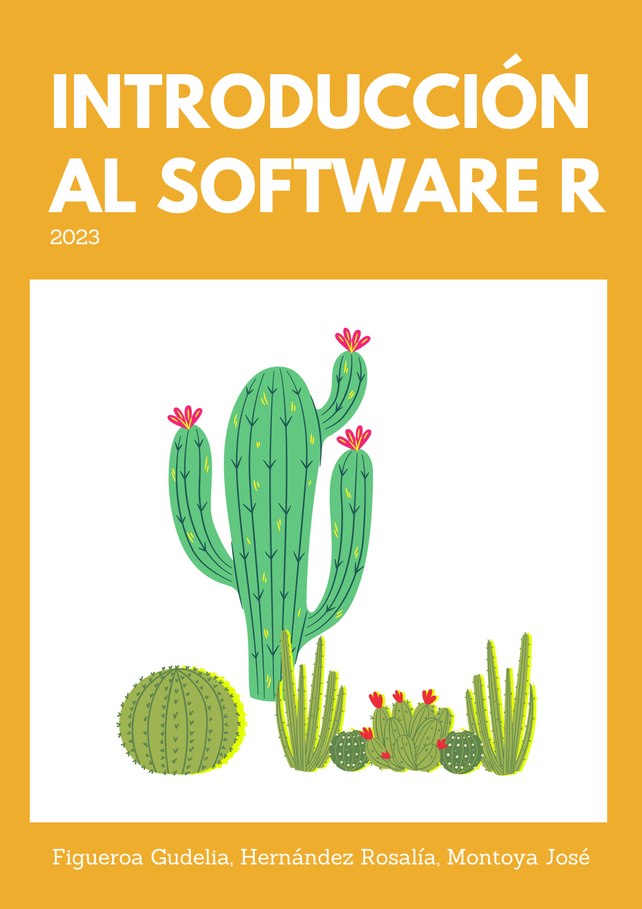

Estas notas fueron elaboradas como recurso de apoyo en el marco del *Taller de Aplicación de técnicas estadísticas*, impartido a estudiantes del Posgrado en Biociencias de la Universidad de Sonora durante el semestre 2022-2, y fueron adaptadas para utilizarse en cursos de Estadística y Bioestadística durante los semestres 2023-1 y 2023-2 con estudiantes de nivel licenicatura.
