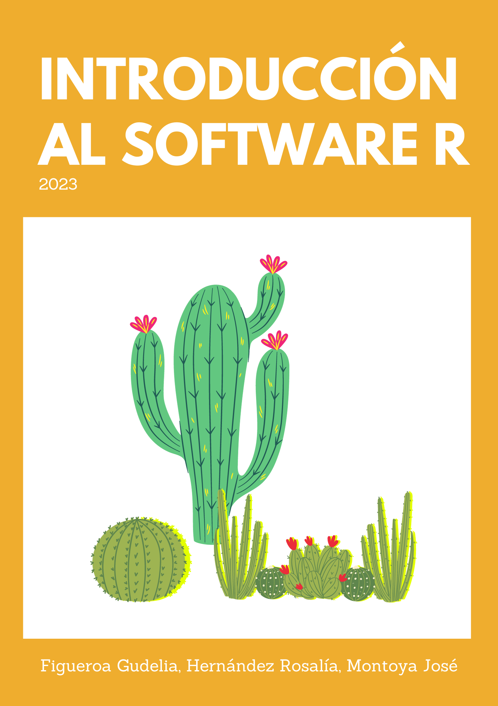

# Prefacio {.unnumbered}

------------------------------------------------------------------------

{style="display: block; margin: 0 auto" width="394"}

Estas notas tienen el objetivo de proporcionar una introducción práctica al uso del software estadístico R, por medio de la interfaz gráfica RStudio.

Las notas fueron elaboradas como recurso de apoyo en el marco del *Taller de Aplicación de técnicas estadísticas*, impartido a estudiantes del Posgrado en Biociencias de la Universidad de Sonora durante el semestre 2022-2, y fueron adaptadas para utilizarse en cursos de Estadística y Bioestadística durante los semestres 2023-1 y 2023-2 con estudiantes de nivel licenicatura.

Cabe mencionar que para los autores, resulta muy gratificante que las notas hayan sido puestas en práctica durante el mencionado taller por los distintos asistentes en sus proyectos de tesis, los cuales abarcan una amplia gama de temas en el área de Biociencias en problemáticas de gran relevancia e impacto regional, como estudios relativos a la dinámica y productividad de la flora y fauna en los distintos ecosistemas que se pueden encontrar en el estado de Sonora, desde las zonas desérticas a las costeras.

<!-- -   Análisis de los hongos micorrízicos arbusculares en una comunidad de plantas del desierto sonorense.
-   Estudio del efecto de los hongos micorrícicos arbusculares en el establecimiento de plantas en un depósito de jal minero de Sonora, México.
-   Desordenes fisiológicos en huertas de nogal pecanero en la costa de Hermosillo, Sonora, México.
-   Biocompósito de nuez pecana para el desarrollo de un biofiltro inoculado con un consorcio de bacterias para la remoción de metales de agua contaminada.
-   Estudio de las diferencias genéticas y composición fitoquímica de frutos de pitaya dulce.
-   Percepción remota para la evaluación de las prácticas de reforestación en zonas áridas-semiáridas de Sonora.
-   Dinámica regional de fenología de superficie y productividad de dos ecosistemas secos.
-   Caracterización metagenómica de virus marinos en granja de cultivo de camarón en el Golfo de California.
-->

Los autores pretenden seguir enriqueciendo el texto con el uso subsecuente de las notas, y se espera que este trabajo sea una herramienta útil para los estudiantes que buscan comprender y aplicar las técnicas estadísticas en sus cursos y proyectos, propiciando la conexión entre la teoría y la práctica en esta disciplina.

*Estas notas fueron elaboradas utilizando R Markdown*

*La versión en línea fue actualizada por última vez el 27 de octubre de 2023*

